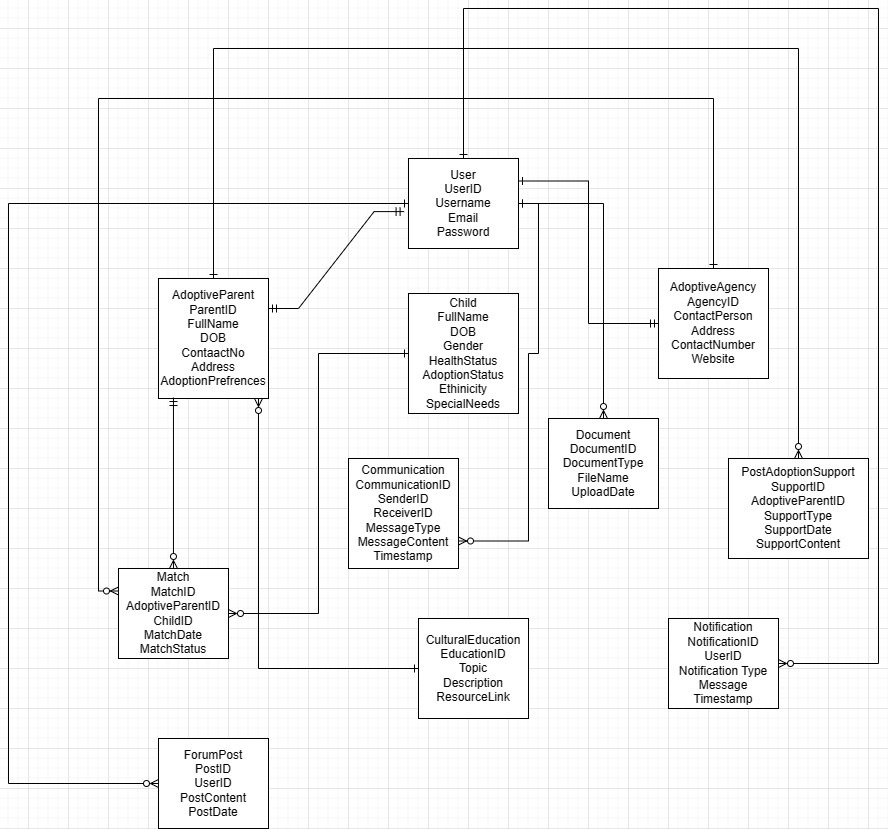

Project Description: 

The child adoption process is an complex process which involving lot of processes and contrinous tracking of data.

Our project focuses on simplifying the adoption process with adding advaced functionalities like profile assesment to ensure the adopted child is in the right hands. Our design places a strong emphasis on facilitating seamless communication and collaboration among adoptive parents, adoption agencies, and various stakeholders, while maintaining comprehensive and continuous records of the child to monitor and ensure their well-being.

We strive to create a transparent and automated system that incorporates a profile assessment tool, offering support and ensuring a user-friendly experience for all stakeholders throughout the entire adoption process.

-->Tools used
 
1. Code Editor: Visual Studio Code (VS Code)
2. Version Control: Git
3. Technology: React , Redux, Express.js, Node.js 
4. Database: MongoDB
 
## Installation
 
1. Clone this repository:
 
```bash
git clone https://github.com/info-6150-fall-2023/final-project-nidhi-patell.git
```
 
2. Open the repository with Visual Studio or any other IDE.
 
3. Run the following command inside client and server directory to install and add node modules
 
```bash
npm install
```
 
4.Run the following commands from project directory to run Client Side

```bash
cd course-app
npm start
```
 
5.Run the following commands from project directory to run Server Side
 
```bash
cd app
node server.js 
```

## Contributing
 
For Contribution to the projects please submit a pull request. For major changes we would like to have a  discussion first.
 

 
## Team Members 
Name: Dainish Chhaya
Name: Aryan Sheth    
Name: Nidhi Patel     
Name: Piyush Chhoriya 


Object Model Diagram:
https://drive.google.com/file/d/1D-E70VM4PGXshjvsPE9mvul8gXEOQ_VW/view?usp=sharing 




